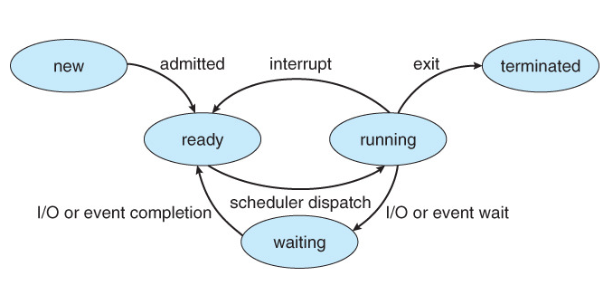

# OS 챕터3- 프로세스

## 프로세스 개념

* OS는 다양한 프로그램을 실행시킨다.
  * 배치시스템
  * 시분할 시스템 
* 프로세스는 현재 실행중인 프로그램 으로 프로세스 실행은 순차작으로 진행되어야만 한다.
* 프로세스는 프로그램 카운터, 스택, 데이터 섹션으로 구성되어있다.

### 스택, 힙, 데이터, 텍스트 영역

* 텍스트 영역(코드영역) -  프로그램이 실행할 코드와 매크로 상수를 저장한다. 컴파일시 결정되고 중간에 코드를 바꿀수 없는 읽기 전용이다.

  매크로 상수 -  C 언어의 # define 과 같은 것을 말한다.

* 데이터 영역 - 코드에서 선언한 전역 변수 또는 static 변수 등이 저장된 공간이다. 실행 중간에 전역 변수가 변경 될수도 있으니 이 영역은 읽기와 쓰기가 모두 가능하다.

  초기화 되지 않은 전역 변수는 bss 부분에 저장된다.

* 스택 영역 - 자료구조로 많이 알려진 stack은 프로세스의 메모리 공간을 관리하기 위한 알고리즘 중 하나이다. 스택영역에는 임시데이터 (매개변수, 리턴값, 돌아올 주소)가 저장되고 함수 호출시 스택영역에 저장되고 종료시 제거된다. 
  컴파일 할때 크기가 결정되어 무한하게 할당 할 수 없다. 스택영역을 초과하여 저장을 시도하면 stack overflow 에러가 발생한다.

* 힙 영역 - 프로그래머가 필요할때마다 사용하는 메모리의 영역으로 다른 영역과 다르게 런타임에 크기가 결정된다. 프로그래머는 malloc,calloc으로 heap영역의 메모리를 사용할 수 있다. 힙영역을 사용하고 난 다음에는 반드시 해제를 해야한다.(하지 않을시 메모리 누수가 발생한다.)
  스택보다 할당할수 있는 메모리공간이 많다는 장점이 있지만 포인터로 메모리 영역을 접근하기 때문에 다른 자료구조에 비해 데이터를 읽고 쓰는게 느리다.

### 프로세스의 상태

* 프로세스 실행시, 상태가 바뀐다. 보통 5가지의 상태로 나눠진다. (OS에 따라 다를수 있다.)

  

  

  | 상태       | 설명                                           |
  | ---------- | ---------------------------------------------- |
  | new        | 프로세스가 막 생성된 상태                      |
  | terminated | 프로세스가 막 끝난 상태                        |
  | ready      | 프로세스가 CPU에 들어가 차례를 기다리는 상태   |
  | waiting    | 프로세스가 I/O같은 이벤트를 기다리고 있는 상태 |
  | running    | 프로세스가 CPU에서 실행되고 있는 상태          |

#### 프로세스 스케줄링 큐

* process(job) queue - 시스템에 존재하는 모든 프로세스의 집합
* ready queue - 현재 메모리에 들어있는 프로세스의 집합으로 실행되기 위해 기다리고 있는 프로세스들이다.
* device queue - I/O 디바이스와 같은 이벤트를 기다리고 있는 프로세스의 집합

### 프로세스 컨트롤 블럭 (PCB)

각각의 프로세스에 대한 관련 정보를 의미한다. 종류는 아래와 같다.

* 프로세스 상태

* 프로그램 카운터

* CPU 레지스터(PC, AC, IR 등)

  | CPU 레지스터 | 설명                                                         |
  | ------------ | ------------------------------------------------------------ |
  | PC           | 다음 인출 될 명령어의 주소를 가지고 있는 레지스터            |
  | AC           | 연산결과 데이터를 일시적으로 저장하는 레지스터               |
  | IR           | 가장 최근에 인출된 명령어를 저장하는 레지스터                |
  | SR           | 현재 상태를 가지고 있는 레지스터                             |
  | MAR          | PC에 저장된 명령어 주소가 사용되기 전에 잠시 저장되는 레지스터 |
  | MBR          | 기억장치에 저장될 데이터나 읽힌 데이터가 잠시 저장되는 레지스터 |

  

* CPU 스케줄링 정보(우선순위, 큐의 포인터 정보)

* 메모리 관리 정보(메모리 위치정보(시작부분, 끝부분 주소), 프로세스 넘버)

* I/O 상태 정보

### 컨텍스트 스위치

컨텍스트란 CPU가 해당 프로세스를 실행하기 위한 해당 프로세스의 정보들을 말한다. 즉, 컨텍스트 스위치란 OS 스케줄러가 한 프로세스를 중단하고 다른 프로세스를 실행시키기 위해 프로세스의 정보를 저장하고 불러오는 과정을 말한다.

해당 과정을 진행하는 중에 CPU는 아무런 일을 하지 못해서 자주 발생할 경우 오버헤드가 늘어나서 효율이 낮아진다.

### 스캐줄러 

* 롱텀 스케줄러(프로세스 스케줄러) - 어떤 프로세스들이 레디를 할지 선택한다.
* 숏텀 스케줄러(CPU 스케줄러) - 어떤 프로세스가 다음에 CPU에 들어갈지 선택한다.
* 미드텀 스케줄러 - 인터럽트 같은 이벤트가 발생할 때 어떤 프로세스를 잠시 디스크로 내려놓을지 결정한다.

* 롱텀 스케줄러가 멀티 프로세싱이 얼마나 가능하게 될지를 결정한다.
* 프로세스는 두가지로 묘사할 수 있다.
  * I/O 위주 프로세스 - CPU보다 I/O 작업을 하는데 걸리는 시간이 더 길다.
  * CPU 위주 프로세스 - CPU를 사용하는 시간이 더 길다.

### 프로세스 종료

* exit()

할일을 다한 프로세스의 마지막 과정으로 OS에게 자원 반납과 함께 삭제를 요청한다.
실행의 결과는 부모 프로세스에 돌아간다.

* abort()

  * 자식 프로세스가 할당 이상의 자원을 사용할 경우
  * 자식 프로세스의 작업이 더이상 필요하지 않은 경우
  * 부모 프로세스가 종료될 경우(몇 OS는 부모 프로세스 종료시 강제로 자식 프로세스를 종료시킨다.)

  위와 같은 경우 부모 프로세스가 자식 프로세스를 강제로 종료 할 수 도 있다. 

### IPC (프로세스 사이의 통신)

프로세스는 다른 프로세스에 영향을 끼치지도 받지도 않는 독립프로세스와 영향을 주고 받으며 자원을 공유하는 협력적인 프로세스로 나눌 수 있는데, IPC는 협력적인 프로세스 사이에서 데이터를 주고 받는 행위 또는 방법을 말한다.

IPC는 프로세스 사이의 통신과 작업의 동기화를 위해 사용하고, 기본적으로 두가지 모델으로 나눠진다.

* 메세지 패싱

  OS가 메모리 보호를 위해 대리 전달 해주는 것을 말한다.

  동기화 문제가 없고, 안전하지만 성능이 좋지 않다.

  direct communication 과 indirect communication으로 나눌 수 있다.

* 공유 메모리

  두 프로세스 사이의 공유된 메모리를 생성하여 이용하는것을 말한다.

  성능은 좋지만 동기화 문제가 발생한다.

  

### 직접통신, 비직접 통신

* 직접 통신

  프로세스는 메세지와 함께 목표에 해당하는 프로세스의 이름을 함께 보내야한다.

  이때 고려사항은 다음과 같다.

  * 링크가 자동으로 생성 되는가?
  * 한 쌍의 프로세스 사이에 오직 한가지 링크만 존재하는가?
  * 쌍방향 통신인가 양방향 통신인가?

* 비직접 통신

  메시지들은 함께 공유하는 메일박스를 통해 전달되고 전달 받는다.

  이때 각 메일박스는 유일한 이름이 있어야하고, 이 메일박스를 통해서만 통신이 가능하다.

  이때 고려사항은 다음과 같다.

  * 링크는 메일박스를 쓸때만 연결하는가?
  * 링크가 여러 프로세스와 연결되는걸 허용하는가?
  * 한 쌍의 프로세스가 한개의 메일박스만 사용할수 있는가 여러개를 사용할 수 있는가?
  * 링크가 쌍방향통신인가 양방향 통신인가?

  

###  동기화

메세지 패싱은 블록킹방식(동기화)과 논블록킹방식(비동기화)으로 이루어진다.

* 블록킹(동기화)

  둘중하나라도 준비가 되지 않으면 작동하지 않는다.(메시지를 보내고 받기 전까지 아무것도 안하고 대기한다.)

* 논 블록킹(비동기화)

  둘중 하나가 준비가 되지 않아도 동작에 문제가 없다.(메세지를 보내고 다른 일을 하거나, 다른 작업을 하다가 메세지를 받을 수 있다.)

###  RPC

한네트워크에 있는 프로시져 사이에서 원격에 있는 프로시져를 호줄하는 작업을 말한다.

* stub  - 서버에 실제로 존재하는 프로시져를 위한 클라이언트측의 프록시이다.

  * 클라이언트 측의 stub는 서버를 찾고 매개변수를 마샬링 한다.
  * 서버 측의 stub는 메시지를 받고 마샬링된 매개변수를 풀어서 서버의 프로시져에서 동작하게 한다.

  마샬(marshall) - 한 객체의 메모리에서  표현하는 방식을 저장 또는 전송에 적합한 다른 데이터 형식으로 변환하는 과정을 말한다.

  [마샬링 위키백과][마샬링 위키]

---

[마샬링 위키]: https://ko.wikipedia.org/wiki/%EB%A7%88%EC%83%AC%EB%A7%81_(%EC%BB%B4%ED%93%A8%ED%84%B0_%EA%B3%BC%ED%95%99)