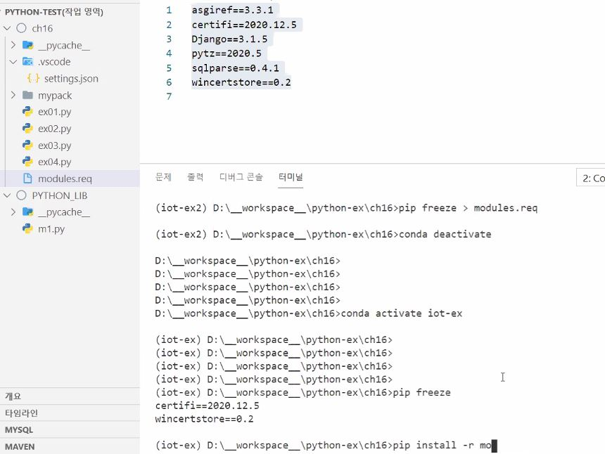

# Python 기초

알고있는 기본적인 부분은 작성하지 않고 새롭게 알게 된것을 정리하기위해 만들었습니다.

[toc]


## 함수

### 인수

def function(일반변수,*가변변수,**키워드 변수):

​	return 0

ex) functions("계산기",88,77,44,55,66,method = "plus")

* 일반 변수

  일반 변수는 항상 가변변수나 키워드 변수보다 앞에 있어야한다.

* 가변변수 ex)print("asdf", "asdf")

  인수의 수가 고정되지 않아 원하는 만큼 인수를 지정할 수 있다.

  함수에서 이를 튜플로 받고 하나만 사용이 가능하다.

  이런식으로도 사용이 가능하다.

  ```python
  a = [1,2,3,4,5]
  
  def func(*list):
  	return list
  
  func(*a)
  ```

* 키워드 변수

  키워드 인수를 가변 개수로 전달 할 때 사용한다.

  dictionary 타입으로 전달이 된다.
  
  이런식으로도 사용이 가능하다.
  
  ```python
  dict = {
  
  "a" : "1"
  
  }
  
  def func(**option):
  	print(option)
  	return 0
  
  func(**dict)
  ```
  
  
  
  
  

 ## docstring

함수의 도움말으로 함수 코드블록 맨앞에 문자열로 작성한다.

""함수의 도움말""" 형식으로 도움말을 넣어주면 

help(함수명) 으로 호출이 가능하다.


## 문자열

### 매서드

* str.find("str")

  왼쪽에서부터 "str"을 찾는다.

* str.rfind("str")

  오른쪽에서부터 "str"을 찾는다.

* str.endswith("str")

  "str"로 시작하는지 확인한다. return bool

* str.startswith("str")

  "str"로 끝나는지 확인한다. return bool

  

 ### 포맷팅

* print(f"이름:{name:4s}, 나이: {age:3d}, 키: {height:.2f}")

  print("")의 ""앞에 f를 넣어 .format을 대신할 수 있다.

  

* 채움 문자

  | 채움문자    | 설명          |
| ----------- | ------------- |
  | 채움문자$ : | 좌우 채움     |
| 채움문자> : | 왼쪽에 채움   |
  | 채움문자< : | 오른쪽에 채움 |
  
  이런식으로도 사용이 가능하다.
  
  ```python
  i = "12"
  
  string = f"{i:0>05s}"
  
  print(string)
  ```


## 컬렉션 관리

### map

* map(매핑함수, 컬렉션) => 컬렉션

  시퀀스의 각 요소를 매핑 함수에 전달하여 매핑함수에따라 새로운 컬렉션을 리턴한다.

    ```python
  def total(s,b):
      return s+b

  score = [45,89,72,53,94]
  bouns = [2,4,6,0,1]
  for s in map(total,score,bonus):
      print(s,end = ",")

      # result => 47, 93, 78, 53, 95,
    ```


### 필터

* filter(판정함수,컬렉션) => 컬렉션

  시퀀스의 각 요소를 판정함수에 전달하여 True인 요소로만 구성된 새로운 시퀀스를 리턴한다.

    ```python
  def flunk(s):
      return s < 60

  score = [45,89,72,53,94]
  for s in filter(flunk,score):
      print(s)

  # result => 45,53
    ```


### 람다함수

* 한줄로 정의되는함수의 축약 표현으로 함수에 이름이 없고 변수에 대입하여 사용한다.

  ```python
  score = [45,89,72,53,94]
  
  for s in filter(lambda x : x< 60, score):
  	print(s)
  	
  # result => 45 53
  ```

  ```python
  lambda x : x+1
  
  # def increase(x):
  # 	return x + 1
  ```

  


## 단정문 (assert)

* assert 조건, 메시지의 형태로 사용하며 조건이 True이면, 통과하지만, False이면 메시지를 가지는 예외를 발생시킨다.

  ```python
  score = 128
  assert score < 100, "점수는 100이하로 설정"
  print(score)
  
  # result => AssertionError : 점수는 100이하로 설정 
  ```


## 모듈

* import traceback

  오류를 위치를 좀더 빠르게 찾기 위해 사용한다.

  ```
  import traceback
  
  traceback.print_stack()	# 예외위치까지 오는데 거친 함수를 출력
  traceback.print_exc()	# 구체적인 예외 내용을 출력
  ```

  


## 클래스

* `__str__` : 클래스의 print 모양에 대한 매서드

  ```python
  class Example:
  	def __init__(self):
  		self.ex = None
  		:
  		:
  
  	def __str__(self):
  		return f"<Example {self.ex}>"
  	
  example = Example()
  print(example)
  
  #result => <Example None>
  ```

  

* `__repr__` :클래스가 list같은 컬렉션안에 있을때의 출력을 위한 매서드

  ```python
  class Example:
      def __init__(self):
  	    self.ex = None
  
  
      def __str__(self):
  	    return f"<Example {self.ex}>"
      
      def __repr__(self):
          return f"<Ex {self.ex}>"
  	
  example = Example()
  li = [example]
  print(li)
  
  # result => <EX None>
  ```

  

* @property,@프로퍼티명.setter : 파이선 에서 사용하는 getter/setter

  ```python
  class Date:
      def __init__(self, month):
          self.inner_month = month
      @property
      def month(self):
          return self.inner_month
      @month.setter
      def month(self, month):
          if 1 <= month <= 12:
              self.inner_month = month
              
  today = Date(8)
  today.month = 10
  print(today.month)
  ```

  property(getter,setter) : 파이선에서 사용하는 getter/setter의 또다른 방법

  ```python
  class Date:
      def __init__(self, month):
          self.__month = month
      def getmonth(self):
          return self.__month
      def setmonth(self, month):
          if 1 <= month <= 12:
              self.__month = month
      month = property(getmonth, setmonth)
  
  today = Date(1)
  print(today.month)
  today.month = 3
  print(today.month)
  ```

  

* @classmethod : 
  클래스멤버변수를 설정한다. self와 무관하게 정의되며 모든 인스턴스가 공유한다.

  ```python
  class Car:
  	count = 0
  	def __init__(self, name):
  		self.name = name
  		Car.count += 1
          
  	@classmethod
  	def outcount(cls):
      	print(cls.count)
          
  pride = Car("프라이드")
  korando = Car("코란도")
  Car.outcount() 
  ```


* @staticmethod : 
  정적매소드로 클래스의 어떤정보도 제공하지 않는 단순히 정의된 함수다.

  ```python
  class Car:
      @staticmethod
      def hello():
          print("hello")
      
  	count = 0
  	def __init__(self, name):
  		self.name = name
  		Car.count += 1
          
  	@classmethod
  	def outcount(cls):
      	print(cls.count)
  ```


### 연산자 메서드

| 연산자 | 메서드   |
| ------ | -------- |
| ==     | `__eq__` |
| !=     | `__ne__` |
| <      | `__lt__` |
| >      | `__gt__` |
| <=     | `__le__` |
| >=     | `__ge__` |
| +      | `__add__` |
| -      | `__sub__` |
| *      | `__mul__` |
| /      | `__div__` |
| //     | `__floordiv__` |
| %      | `__mod__` |
| **     | `__pow__` |
| <<     | `__lshift__` |
| >>     | `__rshift__` |


## 가상환경

* 생성 방법

  1. conda env list : 
     가상환경의 목록을 확인한다.

  2. conda create --name <가상환경 이름> python=<파이썬 버전> 
     ex > conda create --name python_study python=3.7
     가상환경을 생성한다.
  
  
  
* 사용 방법  

  1. conda activate <가상환경 이름> 
     ex> conda activate python_study
     가상환경을 활성화 한다.

  2. pip install <패키지이름>

     ex> pip install django

  3. conda deactivate

     가상 환경을 비활성화한다.(종료한다.)

     

* 삭제 방법

  1. conda remove --name <가상환경 이름> --all 
     ex>conda remove --name python_study --all

     가상환경을 삭제한다.

  

* 가상환경 모듈 공유하는 방법

  freeze : 
  가상환경에 다운 받아져있는 모듈을 정보를 가져오는 명령어이다.

  1. pip freeze > <임의의 파일이름>
     ex> pip freeze > modules.req

     설치된 모듈의 정보를 파일로 저장한다.

  2. pip install -r <앞에서 저장한 파일이름>
     ex>pip install -r modules.req

     저장된 정보를 기반으로 모듈을 설치한다.

  실제 실행 화면

  