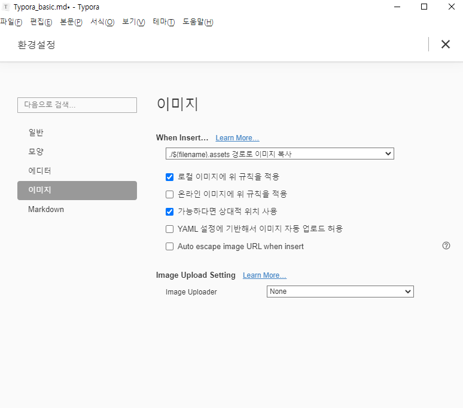
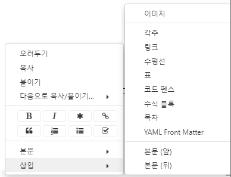

# Typora 사용법

## 기본

모든 단축키는 띄어쓰기가 필요하다.

미리 보기와 편집 보기기능이 따로 있다.

이 보기 방식을 바꾸기위한 단축키는 ' ctrl + / ' 이다.


#   제목은 #

## 소제목은 ##

### 굵고 큰 글씨는 ###

#### 굵은 글씨는 ####

##### 작은 굵은 글씨 #####

###### 더 작은 굵은 글씨 ######

#이 없는 글씨

ctrl + 1~6으로 # 대신 단축키처럼 사용이 가능하다.

제목으로 사용된 것은 모두 왼쪽의 개략 확인이 가능하다.

(보기 > 개략에서 확인 가능하다.)


 ## 리스트 작성

1. crtl + shift + [ 으로 숫자있는 리스트 을 작성할 수 있다.
   1. tab으로 들여쓰기가 가능하다.
2. shift + tab 으로 내려쓰기가 가능하다.

1.  1.을 써서 사용할수도 있다.

- crtl + shift + ] 으로 숫자 없는 리스트를 작성할수 있다.
- *이나 -으로도 작성이 가능하다.


## 코드 작성

```
​```으로 이런 박스 만들어서 사용할수 있다.
안에는 보통 코드를 작성해서 넣는다.
ex>
def hello():
	print("hi")
```

```python
# 아래의 select a language에서 언어를 선택하면
# 하이라이팅을 해준다.
def hello():
	print("hi")
```

짧은 명령문이나 코드는 ` ``으로 하이라이팅 `이 가능하다.

## 표넣기

| 1                 | 2                                     | 3    |
| ----------------- | ------------------------------------- | ---- |
| \| 1 \| 2 \| 3 \| | 이렇게 생긴 3열짜리 표를 만들수 있다. | 3열  |
| # 단축키          | > 설명                                | ```  |
| ctrl + enter      | 새로운 줄로 줄바꿈이 가능하다.        |      |


## 가로줄 넣기


---

---를 쓰면 가로줄이 들어간다. 

---


## 이미지 넣기

md 파일을 위한 이미지를 따로 저장해주기 위해

첫 사용시 파일 > 환경설정 > 이미지 에서 다음과 같이 설정한다.



이제 이렇게 이미지도 넣을 수 있다.


## 인용문 넣기

> '>'를 사용하면 인용문을 넣을 수 있다.


## 기타

우클릭 삽입에서 위에 설명한 기능을 포함하여 더 많은 기능을 사용할 수 있다.

