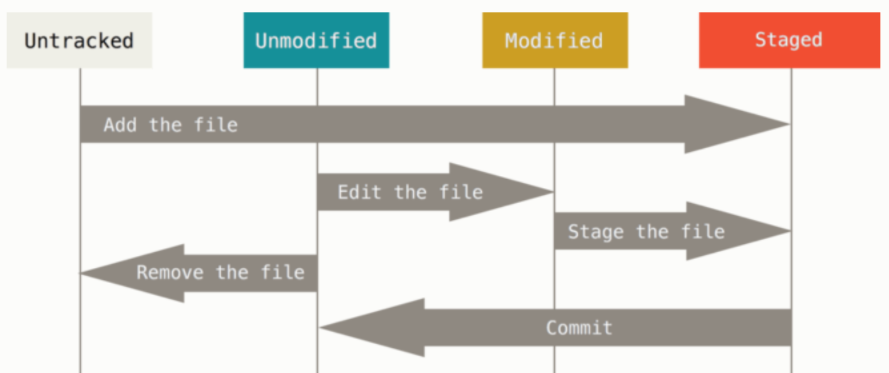

# git 기초

* 목차

[toc]

## What?

### vcs(version control system)

git은 버전관리 시스템이다.


## Why?

협업 및 버전 관리를 위해 사용한다.

변경점 관리, 백업, 복구등이 가능하다.


## Git을 사용하기에 앞서

### CLI

CLI는 command_Line Interface의 약자이고,

Git은 CLI를 사용한다.


#### 명령어

기본적으로 리눅스와 동일하다.

| 명령어 | 설명                                                         |
| ------ | ------------------------------------------------------------ |
| mkdir  | 디렉토리(폴더)를 생성한다.                                   |
| touch  | txt 파일을 만든다.                                           |
| cd     | 디렉토리를 바꾼다.                                           |
| pwd    | 현재 디렉토리위치를 확인한다.                                |
| ls     | 현재 디렉토리에 있는 목록을 본다.<br />-a를 붙이면 숨겨진 파일을 볼 수 있다. |
| rm     | 파일을 삭제한다.<br />-r을 붙이면 디렉토리도 삭제가능하다.<br />-f를 붙이면 무조건 삭제한다. |
| mv     | 파일 혹은 디렉토리를 이동한다.<br />첫번째 인자에서 두번째 인자로 이동한다. |
| vim    | vim을 사용하여 첫번째 인자를 연다.                           |


##### Vim

CLI 문서 편집기이다.

1. 모드

| 모드     | 설명                                                         |
| -------- | ------------------------------------------------------------ |
| 입력모드 | 내용을 입력한다.<br />명령모드에서 i 를 눌러 전환가능하다.   |
| 명령모드 | 명령어를 입력한다.<br />입력모드에서 esc를 눌러 전환가능하다. |

2. 명령어

| 명령어    | 설명         |
| --------- | ------------ |
| :w        | 저장         |
| :q        | 종료         |
| :wq       | 저장 후 종료 |
| :q!       | 강제 종료    |
| {숫자} gg | 줄 이동      |
| dd        | 복사         |
| yy        | 붙혀넣기     |


## Git에 대하여


### 명령어


| 명령어                                                       | 설명                                                         |
| ------------------------------------------------------------ | ------------------------------------------------------------ |
| git init                                                     | 본 폴더를 저장소로 초기화                                    |
| git add < filename >                                         | 파일을 스테이지에 올림                                       |
| git commit -m '내용'                                         | 스테이지에 올라온 변경사항을 commit한다.                     |
| git log                                                      | commit 이력 보기                                             |
| git status                                                   | 저장소의 상태를 확인한다.                                    |
| git restore <file/name>                                      | 변경된 파일을 commit했을때의 상태로 되돌린다.<br />stage에 해당 파일이 있을경우 ㄴstage된 상태롤 되돌린다. |
| git config --global user.name "이름"<br/>git config --global user.email "이메일" | 컴퓨터에서 git 사용자의 이름 혹은 이메일을 설정한다.         |
| git remote add origin <URL>                                  | 원격저장소의 주소를 origin으로 저장하기위해 사용한다.<br />(origin외의 다른이름도 가능은 하다.) |
| git push                                                     | 로컬저장소에서 commit한 내용을 원격저장소에 올리기 위해 사용한다. |
| git pull                                                     | 원격저장소에 commit된 내용을 로컬 저장소에 가져오기 위해 사용한다. |
| git branch                                                   | branch를 생성하거나 삭제하는등 branch와 관련된 작업을 하기 위해 사용한다. |
| git switch                                                   | 현재 사용중인 branch를 바꾸기 위해 사용한다.                 |
| git checkout                                                 | git switch와 거의 같은 기능을 한다.<br />(git checkout의 경우 commit_id로 이동할 수 도 있다.) |
| git merge                                                    | 현재 위치한 브랜치를 중심으로 다른 브랜치를 합치기 위해서 사용한다. |


### 저장소(repository)

* .gitignore 파일

  저장소에서 tracking 하지 않을 파일을 모아서 적어둔 곳으로 보통 가장 먼저 작성하느것이 좋고, .gitignore 파일은 tracking 하지 않는다.  https://gitignore.io 해당 사이트에서 참고가 가능하다.

  ` $ touch .gitignore` 으로 생성한다.

* README.md

  Remote repository에서 열어봤을때 가장 처음 나오는 파일으로 저장소의 설명을 적는다.

  ` $ touch README.md ` 로 생성한다.

* .git 폴더

  저장소의 상태변화(버전)을 추적 관리하는 폴더로 일반적으로 편집하지 않는다.

  ` $ git init ` 를 통해 생성한다.

  

#### 저장소 내부 파일의 상태 변화

저장소 내부의 파일은 아래의 그림과 같이 상태 변화를 한다.



- untracked/untracking

  git이 추적하지 않는 폴더(파일)이다. 

  `$ git add `를 사용하여 tracking 할 수 있다.

- unmodified

  tracking하고 있으나 변경사항이 없는 폴더이다.

  폴더에 변경사항이 있을시 modified 상태로 변화한다.

- modified

  tracking하는 폴더에 변경사항이 있는 상태이다.

  `$ git add`를 통해 stage에 올릴 수 있다.

- staged

  변경사항을 stage에 올려놓은 상태이다.

  이 상태에 있는 변경사항은 ` $ git commit ` 으로 commit 할 수 있고, commit한 뒤에는 unmodified 한 상태로 돌아간다.


### 사용 방법

#### git config

git을 처음 사용할 때에는 아래의 명령어를 사용해 사용자의 이메일을 반드시 입력하여야한다.

```
$ git config --global user.name "이름"
$ git config --global user.email "이메일"
```


#### git init

파일을 저장소(repository)로 만들기위해 아래의 명령어를 사용한다.

```
$ git init
```

 만약 상위 폴더가 git 저장소로 초기화 되어있는 경우에 git init를 할경우 서브모듈로 작동한다.


#### git status

저장소내부의 상태를 확인하기 위해 아래의 명령어를 사용한다.

```
$ git status
```


#### git add 

파일을 stage 상태로 만들기 위해서 다음과 같은 명령어를 사용한다.

```
$ git add <file/dirname>
```


#### git commit

stage에 올라온 파일을 commit하기 위해서 다음과 같은 명령어를 사용한다.

```
$ git commit -m "first commit"
```


#### git restore

변경했던 파일에 문제가 생겨 복구해야할 일 이 생긴다면 아래의 명령어를 사용해서 복구 할 수 있다.

``` 
$ git restore <file/dirname>
```


#### git log

현재 저장소에서 commit한 이력을 보고 싶을 때에는 아래의 명령어를 사용한다.

```
$ git log
```

HEAD를 통해 현재 보고있는 branch를 확인 할 수 있다.


브랜치를 짧게 줄여서 보고 싶다면 다음과 같이 사용할 수 있다.

```
$ git log --pretty=oneline --abbrev-commit
```


브랜치를 이미지화 해서 같이 보려면 다음과 같이 사용할 수 있다.

```
$ git log --pretty=format:"%h %s" --graph
```


#### git remote

깃허브같은 원격 저장소(remote repository)의 주소를 가져와서 원하는 이름으로 저장한다.

```
$ git remote add origin <URL>
# git remote add <(remote)name> <URL>
```


저장된 원격저장소 중 필요 없는 것을 지울 수도 있다.

```
$ git remote remove <(remote)name>
```


#### git push

로컬 저장소에서 원격 저장소에 파일을 올린다.

```
$ git push origin master
# git push <(remote)name> <branch>
```


#### git pull

원격 저장소에서 로컬저장소로 파일을 가져온다.

```
$ git pull origin master
# git pull <(remote)name> <branch>
```


####  git branch

브랜치를 새롭게 만들거나 지우는 등 다양한 일을 할 수 있다.


현재 존재하는 브랜치의 목록을 확인하는 명령어이다.

```
$ git branch
```


브랜치를 새롭게 생성할 때 사용하는 명령어이다. 

```
$ git branch <name>
```


용도를 다한 브랜치를 지울때 사용하는 명령어 이다.

```
$ git branch -d <name>
```

브랜치에 merge 되지 않은 내용이 있다면, -d로는 삭제가 불가능하다.
이 때 -D를 사용하면 강제로 삭제가 가능하다.

```
$ git branch -D <name>
```


#### git switch && git checkout

브랜치 사이에서 이동을 하거나 commit 했던 순간으로 이동하기 위해 사용한다.

이미 만들어진 브랜치로 이동을 하기 위해서 사용하는 명령어이다.

```
$ git switch <branch>
OR
$ git checkout <branch>
```


브랜치를 생성함과 동시에 이동을 하기 위해서 사용하는 명령어이다.

```
$ git switch -c <branch>
OR
$ git checkout -b <branch>
```


특정한 과거의 시점을 보기 위해서 다음과 같은 명령어를 쓸수 있다.

```
$ git checkout <commit_id>
```

이 때 commit_id는 git log를 통해 확안할 수 있다.


#### git merge

현재 위치한 브랜치를 중심으로 다른 브랜치를 합치기 위해서 사용한다.

```
$ git merge <branch>
```

merge를 할 경우 3가지의 경우를 볼 수 있다.

* 두 브랜치 중 하나의 브랜치에서만 변화가 일어난 경우
* 두 브랜치 모두 변화가 일어났지만 서로 다른 부분을 수정한경우
* 두 브랜치 모두 변화가 일어났고 서로 같은 부분을 수정한 경우


각각의 경우에 대해 알아보자

* 두 브랜치 중 하나의 브랜치에서만 변화가 일어난 경우


​		Fast-forward라는 문구가 뜨며 쉽게 merge가 가능하다.


* 두 브랜치 모두 변화가 일어났지만 서로 다른 부분을 수정한 경우

  merge를 했을 때, 아래와 같은 화면이 뜬다.

  

​		이 화면에서  그냥 나가거나, 저장하고 나가면 


​		다음과 같은 출력과 함께 자동으로 merge가 된다.


* 두 브랜치 모두 변화가 일어났고 서로 같은 부분을 수정한 경우

  merge를 했을 경우 다음과 같은 화면이 발생한다.

  

​		이 때 충돌이 난 파일에 들어가 보면 다음과 같은 화면을 볼수 있다.

​										

​		

​		여기에서 원하는 부분만 남기고 모두 지운다.

​		

​		모든 충돌 부분이 해결이 되지 않으면 다음과 같이 충돌이 해결되지 않았다는 말이 나온다.


​	모든 충돌 부분이 해결 되었다면 다음과 같이 수동으로 merge 가 완료된다.


### Git flow(협업 시의 흐름)

git을 활용해 협업을 할때에는 항상 master가 중심이 되도록 가장 최신 되도록 해야한다.

` $ git push origin master ` 처럼 master에 직접 push하는 일은 반드시 피해야한다.

(가능은하지만 협업시 하지 않는 것이 충돌이나 버전 관리에 유리하다.)

1. 각자 브랜치에서 작업한다. (commit)

2. 각자의 브랜치에 push도 종종한다.

3. 적절한 시점에 리모트/master와 브랜치를 merge 한다.

   이 때, Pull Request 를 통해서 리모트에서 원격으로 merge 진행한다.

4. 리모트 merge 종료 이후, 로컬에서 master 브랜치로 origin/master 를 pull 한다.

   (git pull origin master)

5. pull 이후에 바로 다른 브랜치를 생성해서 작업한다. 

6. 위의 작업을 반복한다.


## 참고 사이트

[깃 기본서]: http://git-scm.com/book/ko/v2
[깃이그노어작성사이트]: https://gitignore.io


